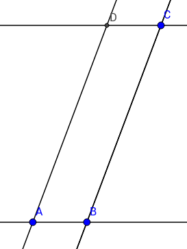
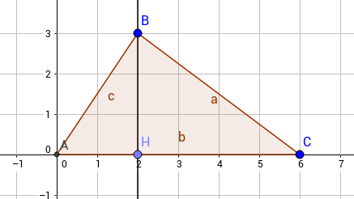

\begin{problem}[1 (1.1)]
Для любых $a,b,c \in K$ выполнены равенства
\end{problem}
$\forall a, b, c \in K$:

a) $a0=0a=0$
	\Begin{solution}
	$a0=a(0+0)=a0+a0 \Then a0=0$
	
	$0a=0$ --- аналогично.
	\End{solution}

b) $a(-b)=(-a)b=-ab$
	\Begin{solution}
	$0=a0=a(b-b)=ab+a(-b) \Then -ab = a(-b)$
	\End{solution}

c) $(a-b)c = ac-bc$ и $a(b-c)=ab-ac$
	\Begin{solution}
	$(a-b)c+bc = (a-b+b)c=ac \Then (a-b)c = ac-bc$

	$a(b-c)+ac=a(b-c+c)=ab \Then a(b-c)=ab-ac$
	\End{solution}

\begin{problem}[2(1.2)]
\end{problem}
a) В кольце не может быть двух различных единиц.
	\Begin{solution}
	$1_1 \ubrace{=}{\text{т. к.} 1_2 \text{--- единица}} 1_1 \cdot 1_2 \ubrace{=}{\text{т. к.} 1_1 \text{--- единица}} 1_2$
	\End{solution}
b) Пусть кольцо с единицей содержит не меньше двух элементов. Тогда $1 \neq 0$.
	\Begin{solution}
	$\forall a \in K\ a \ubrace{=}{\text{св-во 1}} a \cdot e \ubrace{=}{\text{св-во 0}} 0$
	\End{solution}
c) Может ли элемент ассоциативного кольца иметь более одного обратного элемента?
	\Begin{solution}
	Пусть $a_1 \ne a_2$ --- обратные к $a$ элементы. Тогда 
	$a_1 a a_2 = \begin{cases} a_1 \cdot 1 = a_1 \\ 1 \cdot a_2 = a_2 \end{cases}$
		
	Получается, они равны.
	\End{solution}

\begin{problem}[3(1.3, 2.4)]
Уметь отвечать на вопросы: является ли данное кольцо K коммутативным? ассоциативным?кольцом с единицей? область целостности? поле? евклидово кольцо? Какие в K есть обратимые элементы? неразложимые? простые?
\end{problem}

\begin{problem}[4 (2.1(в))]
Обратимый элемент кольца не может быть делителем нуля.
\end{problem}
\Begin{solution}
Пусть $a \in K$ обратим, $\exists a^{-1} \in K: aa^{-1} = 1$. Если $a$ --- делитель нуля, то $\exists 0 \ne b \in K: ab=0$. Тогда $a^{-1} a b = \begin{cases} a^{-1} \cdot 0 = 0 \\ 1 \cdot b = b \ne 0 \end{cases}$.
Противоречие.
\End{solution}

\begin{problem}[5(2.1(д))]
Если $K$ --- кольцо без делителей нуля, то возможно сокращение: если $ac=bc$ и $c \neq 0$, то $a=b$.
\end{problem}
\Begin{solution}
$ac=bc \Iff (a-b)c=0 \Then$ т. к. нет делителей нуля и $c \ne 0$, д. б. $a-b=0$, т. е. $a=b$.
\End{solution}

\begin{problem}[6(2.1(г))]
В конечном коммутативном кольце если ненулевой элемент не является делителем нуля, то он обратим.
\end{problem}
\Begin{solution}
Кольцо конечно $\Then$ его элементы можно занумеровать: $a_1, \dots, a_n$. Элементы $a\cdot a_1, \dots, a \cdot a_n$ должны быть все разные (иначе $\forall i \ne j, a \ne 0 \ a\cdot a_i = a \cdot a_j \Then \ubrace{a}{\ne 0} \ubrace{(a_i-a_j)}{\ne 0\text{, т. к. }i \ne j} = 0$, т. е. $a$ --- делитель нуля).

Тогда $\exists i: a \cdot a_i = 1$, т. к. $1 \in K$ (т. е. $a\cdot a_1, \dots, a \cdot a_n$ --- $n$ разных элементов кольца, а в кольце всего $n$ элементов; значит, какое-то $aa_i$ должно быть $1$).
\End{solution}

\begin{problem}[7]
Конечная область целостности --- поле.
\end{problem}
\Begin{solution}
В области целостности нет делителей нуля, а если в конечном коммутативном кольце элемент --- не делитель нуля, то он обратим (№6). Т. е. все элементы обратимы.

TODO: $\ge 2$ эл-тов.
\End{solution}

\begin{problem}[8]
Множество $K^*$ обратимых элементов коммутативного кольца K является группой по умножению. Она называется \textbf{мультипликативной группой}, или \textbf{группой обратимых элементов} кольца $K$.
\end{problem}
\Begin{solution}
Пусть $K$ --- кольцо, $a, b \in K^*$. Тогда $\exists a^{-1}, b^{-1} \in K^*$. Проверим групповые свойства.

1. a(bc) = (ab)c --- ассоциативность в $K^*$ следует из свойств кольца $K$.
2. $\exists 1 \in K^*$ (т. к. $K^* \ne \emptyset$, $\exists a \in K^*$, по свойству обратимости $\exists a^{-1} \in K^*: aa^{-1} = 1$ --- единица в $K$ будет являться единицей в $K^*$).
3. $(b^{-1}a^{-1})(ab) = (ab)(b^{-1}a^{-1})=1 \Then (ab)^{-1} = b^{-1} a^{-1} \in K^*$ --- обратимость.

Значит, $K^*$ --- группа по умножению.
\End{solution}

\begin{problem}[9(1.5-1.7)]
Базовые знания про комплексные числа: сложение, умножение, модуль, аргумент, извлечение корней n-ой степени.
\end{problem}
\Begin{solution}
**Компл\'ексное число** $z$ --- это выражение вида $z=a+bi$, где $a$ и $b$ --- числа из $\R$, а $i$ --- **мнимая единица**. По определению  $i^2=-1$.
Число $a$ называют **вещественной частью** комплексного числа $z$ (пишется $a={\rm Re}\,(z)$), а число $b$ --- **мнимой частью** $z$ (пишется $b={\rm Im}\,(z)$).
Комплексные числа можно складывать и умножать, \lgq раскрывая скобки и приводя подобные\rgq. Множество комплексных чисел обозначают буквой $\C$.

Каждому комплексному числу $z=a+bi$ сопоставим точку $(a,b)$ и вектор $(a,b)$. Длина этого вектора называется **модулем** числа $z$ и обозначается $|z|$.  Пусть $z\ne0$.
Угол (в радианах), отсчитанный против часовой стрелки от вектора $(1,0)$ до вектора $(a,b)$, называется **аргументом** числа $z$ и обозначается ${\rm Arg}\,(z)$. Аргумент определен с точностью до прибавления числа вида $2\pi n$, где $n\in\Z$.

**Тригонометрическая форма записи.** Для любого ненулевого комплексного числа $z$ имеет место равенство\\ $z=r (\cos \varphi +i\sin \varphi )$, где $r=|z|$, $\varphi={\rm Arg}\,(z)$.

Для комплексного числа $z=r(\cos\varphi+i\sin\varphi)$ и натурального числа $n\in\N$ выполнена **формула Муавра** \\
$z^n=r^n(\cos n\varphi+i\sin n\varphi)$.

Для комплексного числа $z=a+bi$, где $a,b\in \R$ число $\overline{z}=a-bi$ называется **комплексно-сопряжённым** к $z$. Выполнены следующие равенства:

$|z|^2=z\overline{z}$, $\overline{z+w} = \overline{z} + \overline{w}$, $\overline{zw}= \overline{z}\overline{w}$.

\End{solution}

\begin{problem}[10(2.2)]
\end{problem}
a) Следующие условия эквивалентны:
	(1) $x \sim y$;
	(2) $x \mid y$ и $y \mid x$;
	(3) множество делителей $x$ и множество делителей $y$ равны.
	
	\Begin{solution}
	
	* $(1) \Then (2):$
		$\exists r \in K^*: x=ry \Then y|x$ по определению.
		Т. к. $r \in K^*$, $\exists r^{-1} \in K^*: r^{-1}x=y \Then x|y$ по определению.
	* $(2) \Then (3):$
		Пусть $x|y, x \Divby a$. Тогда $y = xc, x = ab$ (по опр.) $\Then$ $y = xc = abc = a(bc) \Then y \Divby a$.
	* $(3) \Then (2):$
		Множества делителей $x$ и  $y$ совпадают, $x|x \Then x$ будет во множестве делителей $y$, т. е. $x|y$. Симметрично, $y|x$.
	* $(2) \Then (1):$
		$\begin{cases}
		x | y \Then y = kx\\
		y | x \Then x = ty
		\end{cases}$
		Тогда $y=kty \Then kt = 1$ Значит, $k$ и $t$ обратимы. Значит, $x=ty, t \in K^* \Then x \~ y$ по определению.
	
	\End{solution}

b) Отношение $\sim$ является отношением эквивалентности.
	\Begin{solution}
	
	1. $x\~x$, т. к. $\exists 1 \in K^*: x=1x$
	
	2. $x \~ y \Then \exists r \in K^*: x = ry \Then y = r^{-1}x \Then y \~ x$
	
	3. $x \~ y, y \~ z \Then 
		\begin{cases}
		\exists r_1 \in K^*: x=r_1 y\\
		\exists r_2 \in K^*: y=r_2 z
		\end{cases}
		\Then x = \ubrace{r_1 r_2}{\in K^* \text{, т. к. }(r_1 r_2)^{-1} = r_2^{-1} r_1^{-1}} z \Then x \~ z$
	
	\End{solution}
	
\begin{problem}[11 (2.5)]
Если $a, b, k \in \Z$, $u\not \in \Q$, то $z= a+bu \in \Z[u]$ делится на $k$ тогда и только тогда, когда $a$ и $b$ делятся на $k$.
\end{problem}
\Begin{solution}

* $\Then:$
	$\begin{cases} a \Divby k \\ b \Divby k \end{cases} \Then \begin{cases} a = ka' \\ b = kb' \end{cases} \Then z = a+bu = ka'+kb'u=k(a'+b'u) \Then z \Divby k$
	
* $\Then$:
	Пусть $z = a + bu = ka' + kb'u$. Тогда $(a - ka') = u(b - kb')$.

	Обе части целые $\Then$ нули, потому что $u$ не рациональное.
	
	Отсюда $\begin{cases} a = ka' \\ b = kb' \end{cases} \Then \begin{cases} a \Divby k \\ b \Divby k \end{cases}$.

\End{solution}

\begin{problem}[12(2.9 $\When$)]
$K$ — евклидово кольцо. Верно ли, что для $a \ne 0, b \in K^*$ выполнено равенство $N(ab) = N(a)$?
\end{problem}
\Begin{solution}
$b \in K^* \Then N(a) \le N(ab) \le N(abb^{-1}) = N(a)$
\End{solution}

\begin{problem}[13 (3.2)]
Для $u=i,\omega$ и простого целого числа $p \leq 40$ выясните, существует ли $z \in D$ с $N(z)=p$. Сформулируйте гипотезу о том, какие простые целые числа являются простыми в $D$. 
\end{problem}
\Begin{solution}

Выпишем все варианты $a, b$  с нормой $\le 40$. 

**Зам.** Можно опустить перебор по $ka', kb'$ при $k > 1$, потому что тогда обе нормы делятся на $k^2$.

TODO: отрицательные значения.

| a | b | $\mathbb{Z}[i], N = a^2+b^2$ | $\mathbb{Z}[\omega], N = a^2-ab+b^2$ |
|---|---|------------------------------|--------------------------------------|
| 1 | 1 | 2                            | 1                                    |
| 1 | 2 | 5                            | 3                                    |
| 1 | 3 | 10                           | 7                                    |
| 1 | 4 | 17                           | 13                                   |
| 1 | 5 | 26                           | 21                                   |
| 1 | 6 | 37                           | 31                                   |
| 2 | 2 | -                            | -                                    |
| 2 | 3 | 13                           | 7                                    |
| 2 | 4 | -                            | -                                    |
| 2 | 5 | 29                           | 19                                   |
| 2 | 6 | -                            | -                                    |
| 2 | 7 | 53                           | 39                                   |
| 3 | 3 | -                            | -                                    |
| 3 | 4 | 25                           | 13                                   |
| 3 | 5 | 34                           | 19                                   |
| 3 | 6 | -                            | -                                    |
| 3 | 7 | 58                           | 37                                   |
| 4 | 4 | -                            | -                                    |
| 4 | 5 | 41                           | 21                                   |
| 4 | 6 | -                            | -                                    |
| 4 | 7 | 65                           | 37                                   |
| 5 | 5 | -                            | -                                    |
| 5 | 6 | 61                           | 31                                   |
| 5 | 7 | 74                           | 39                                   |
| 6 | 6 | -                            | -                                    |

Пользуемся утверждением с лекции: Пусть p -- простое целое, $\forall z \in D: N(z)\ne p \Then$ p неразложим в D.

Выпишем все простые числа $\le 40$ и вычеркнем те, которые являются нормой. Берём оставшиеся.

\begin{table}[H]
\centering
\begin{tabular}{llllll}
\multicolumn{3}{c}{$\Z[i]$} & \multicolumn{3}{c}{$\Z[\omega]$} \\
        & 2      & \x     & \y       & 2        &          \\
\y      & 3      &        &          & 3        & \x       \\
        & 5      & \x     & \y       & 5        &          \\
\y      & 7      &        &          & 7        & \x       \\
\y      & 11     &        & \y       & 11       &          \\
        & 13     & \x     &          & 13       & \x       \\
        & 17     & \x     & \y       & 17       &          \\
\y      & 19     &        &          & 19       & \x       \\
\y      & 23     &        & \y       & 23       &          \\
        & 29     & \x     & \y       & 29       &          \\
\y      & 31     &        &          & 31       & \x       \\
        & 37     & \x     &          & 37       & \x        
\end{tabular}
\end{table}

Гипотеза: 
* у $\Z[i]$ $4k+3$
* у $\Z[\omega]$ $3k+2$ или TODO.
\End{solution}

\begin{problem}[14 (3.9)]
\end{problem}
\Begin{solution}

a) $0 \subset K, K \subset K$ --- идеалы. Они называются **тривиальными**.
	* $\{0\}$:
		1. Тривиальная группа по сложению: 
			* Ассоциативность наследуется
			* $0$ --- нейтральный элемент, т. к. $0+a=a+0=0 \forall a \in \{0\}$
			* $0^{-1} = 0 = -0$
		2. Замкнутость относительно умножения:
			$\forall a \in K 0a=0 \in \{0\}$
	* $K$:
		1. Тривиальная группа по сложению: 
			* Ассоциативность наследуется
			* $0$ --- нейтральный элемент, т. к. $0+a=a+0=0 \forall a \in K$
			* $a^{-1} = -a \in K$
		2. Замкнутость относительно умножения:
			$\forall a \in K \forall b \in I=K \ ab \in I=K$ --- по свойству кольца
b) $(a) = \{ax \mid x\in K\}$ --- **главный идеал** или **идеал, порождённый одним элементом**
	1. Подгруппа по сложению: 
		* $ax_1+ax_2=a(x_1+x_2)\in(a)$ --- замкнутость относительно сложения
		* Ассоциативность наследуется
		* $0$ --- нейтральный элемент: $ax+0=0+ax=ax$
		* $ax+a(-x)=a(x-x)=a\cdot 0=0$
	2. Замкнутость относительно умножения:
		$\forall b \in K \forall ax \in (a) \ b\cdot ax = bx \cdot a \in (a)$
c) $(a_1,\ldots,a_n) = \{a_1x_1+\ldots+a_nx_n \mid x_1,\ldots,x_n \in K\}$ --- **конечно-порождённый идеал**, то есть идеал, порождённый конечным количеством элементов.
	1. Подгруппа по сложению: 
		* $(a_1x_1+\dots+a_nx_n)+(a_1y_1+\dots+a_ny_n) = a_1(x_1+y_1)+\dots+a_n(x_n+y_n) \in I$ --- замкнутость относительно сложения
		* Ассоциативность наследуется
		* $0 = a_1\cdot 0+\dots+a_1\cdot0$ --- нейтральный элемент: $ax+0=0+ax=ax$
		* $(a_1x_1+\dots+a_nx_n)+(a_1(-x_1)+\dots+a_n(-x_n))=0$
	2. Замкнутость относительно умножения:
		$\forall y \in K \ y\cdot (a_1x_1+\dots+a_nx_n) = a_1(x_1y)+\dots+a_n(x_ny) \in I$

\End{solution}

\begin{problem}[15(3.11)]
a) Докажите, что $(a) \subset (b)$ тогда и только тогда, когда $b \mid a$.

b) Докажите, что $a \sim b$ тогда и только тогда, когда $(a)=(b)$.
\end{problem}
\Begin{solution}

a) 
	* $\When:$ $b | a \Then \exists c: a=cb \Then ka=(kc)b \Then (a) \subset (b)$
	* $\Then:$ $(a) \subset (b) \Then a \in (b) \Then a=cb \Then a|b$
b) 
	* $\Then:$ $a \~ b \Then \begin{cases} a|b \\ b|a \end{cases} \Then (a) \subset (b) \subset (a) \Then (a) = (b)$
	* $\When:$ $(a) = (b) \Then \begin{cases} a|b \\ b|a \end{cases} \Then a \~ a$

\End{solution}

\begin{problem}[16(3.12)]
Пусть $I,J \subset K$ --- идеалы. \textbf{Сумма} $I+J = \{x+y \mid x \in I,y \in J\}$ и \textbf{пересечение} $I \cap J$ идеалов являются идеалами. 
\end{problem}
\Begin{solution}

a)
	1.
		* $(x_1+y_1)+(x_2+y_2) = \ubrace{(x_1+x_2)}{\in I}+\ubrace{(y_1+y_2)}{\in J} \in I+J$
		* Ассоциативность следует.
		* 0 --- нейтральный.
		* $(x+y)+\ubrace{(-x-y)}{\in I+J} = (x-x)+(y-y)=0$ --- обратный
	2. $\forall a \in K \Have a(x+y)=\ubrace{ax}{\in I}+\ubrace{ay}{\in J} \in I+J$

b)
	1.
		* $x, y \in I \cap J \Then 
			\begin{cases} x, y \in I \\ x, y \in J \end{cases} \Then
			\begin{cases} x + y \in I \\ x + y \in J \end{cases} \Then
			x+y \in I+J$
		* Ассоциативность следует.
		* 0 --- нейтральный
		* $x \in I\cap J \Then
			\begin{cases} x \in I \\ x\in J \end{cases} \Then
			\begin{cases} x^{-1} \in I \\ x^{-1} \in J \end{cases} \Then
			x^{-1} \in I+J$ --- обратный
	2. $\forall a \in K\ \forall x \in I\cap J \Have 
			\begin{cases} x\in I \\ x\in J \end{cases} \Then 
			\begin{cases} ax\in I \\ ax\in J \end{cases} \Then
			ax \in I \cap J$

\End{solution}

\begin{problem}[17(3.15)]
Пусть $K \neq 0$. Докажите, что $K$ является полем тогда и только тогда, когда $K$ не содержит нетривиальных идеалов.
\end{problem}
\Begin{solution}

* $\Then:$
	Пусть K --- поле, $I \subset K$ --- идеал. 
	* $x = 0 \Then (x) = \{0\}$ --- тривиальный идеал.
	* $\forall x \in I, x \ne 0, \ x$ обратим по свойству поля, значит, $I \supset (x) = (1) = K$.
* $\When:$
	Пусть K --- коммутативное кольцо без нетривиальных идеалов. Пусть $x \in K, x \ne 0,$ --- произвольный элемент. Тогда $(x) \ne \{0\}$. Значит, поскольку у нас нет нетривиальных идеалов, $(x) = K$.
	
	В частности, $1 \in (x) = K \Then \exists x^{-1}$, т. е. элемент x обратим.
	
	В силу произвольности x, любой ненулевой элемент обратим $\Then$ K --- поле (в K $\ge$ 2 элементов, т. к. $0 \in K$, и мы брали $0\ne x \in K$).

\End{solution}

\begin{problem}[18(4.1)]
Верно ли, что при гомоморфизме колец $\varphi: K \to L$ 
a) образ; b) прообраз идеала является идеалом?
\end{problem}

a) 
	\Begin{solution}
	Неверно. Контрпример: $\phi:\Z \to \Q, \phi(x)=x$ --- поэлементное вложение.
	
	$I=\Z$ в $\Z$ --- тривиальный идеал. Но $\phi(I)=\Z$ --- не идеал в $\Q$, ибо, например, $\ubrace{\frac{1}{2}}{\in \Q} \cdot \ubrace{1}{\in \Z} = \frac{1}{2} \not\in I$.
	\End{solution}
b)	
	\Begin{solution}
	Верно. Пусть $J$ --- идеал в L. $\phi^{-1}(J) = \{a \in K : \phi(a) \in J\}$.
	
	$\forall a, b \in \phi^{-1}(J): 
	\begin{cases}
	\phi(a+b) = \phi(a)+\phi(b) \Then a+b \in \phi^{-1}(J)\\
	\phi(a^{-1}) = (\phi(a))^{-1} \in J
	\end{cases}$
	
	$\forall x \in K \forall a \in \phi^{-1}(J) \ \phi(ax)=\phi(a)\phi(x) \in J$.
	
	Значит, $\phi^{-1}(J)$ --- действительно идеал.
	\End{solution}

\begin{problem}[19(4.2)]
\end{problem}
a) Всегда ли факторкольцо коммутативного кольца является коммутативным кольцом?
	\Begin{solution}
	* Ассоциативность по сложению --- из ассоциативности коммутативного кольца.
	* $0 \in K$ --- ноль в $K$ $\Then$ $0+I=I$ --- ноль в $K^*$: $(I)(a+I) = (a+I)(I) = aI+I^2 = I$.
	* Обратный по сложению: $(a+I)+(-a+I) = (-a+I)+(a+I) = I$.
	* Дистрибутивность: $(a+I)(b+I+c+I) = (ab+I)+(ac+I)$.
	* $1 \in K$ --- единица в $K$ $\Then$ $1+I$ --- единица в $K^*$: $(1+I)(a+I) = (a+I)(1+I) = a+I+aI+I^2 = a+I$.
	* Ассоциативность по умножению --- из ассоциативности коммутативного кольца.
	* $(a+I)(b+I) = ab+aI+bI+II=ab+I=ba+I=ba+bI+aI+II=(b+I)(a+I)$ --- коммутативность.
	
	\End{solution}

b) Имеется **канонический** гомоморфизм $\varphi: K \to K/I$, который переводит $a \mapsto a+I$.
	\Begin{solution}
	Проверим свойства гомоморфизма:
	* $\phi(a)+\phi(b)=a+I+b+I= (a+b)+I=\phi(a+b)$
	* $\phi(a)\phi(b) = (a+I)(b+I) = ab+aI+bI+II = ab+I = \phi(ab)$
	* $\phi(1) = 1+I = 1_{\sfrac{K}{I}}$
	
	\End{solution}

\begin{problem}[20(4.5)]
Пусть $K$ --- область целостности. Идеал $(x)$ является простым тогда и только тогда, когда $x$ прост.
\end{problem}
\Begin{solution}
$(x)$ --- простой $\Bydef$ если $ab \in (x)$, то $\begin{sqcases} a \in (x) \\ b \in (x) \end{sqcases}$

$x$ --- простой $\Bydef$ если $ab \Divby x$, то $\begin{sqcases} a \Divby x \\ b \Divby x \end{sqcases}$

Но $ab \in (x) \Iff ab \Divby x$ (ибо $(x) = \{ax \mid a \in K\}$ по определению, и $ab \in K$).
\End{solution}

\begin{problem}[21(4.6)]
Пусть $K$ --- область целостности. Нетривиальный идеал $I$ является максимальным тогда и только тогда, когда $K/I$ поле.
\end{problem}
\Begin{solution}
Знаем (№17): $\sfrac{K}{I}$ --- поле $\Iff$ в $\sfrac{K}{I}$ нет нетривиальных идеалов.

Пусть $\sfrac{K}{I}$ --- поле, пусть $\exists I: I \subset J \subset K$ --- нетривиальный идеал. Подействуем на него каноническим гомоморфизмом $\phi: K \to \sfrac{K}{I}$. 

**Лемма.** Пусть $f: K \to L$ --- гомоморфизм колец, $I \subset K, J \subset L$ --- идеалы. Тогда a) $f(I)$ --- идеал в $f (K)$, b) $f^{-1} (J)$ --- идеал в K.
\begin{solution}
a) Пусть $x \in f(I), y \in f(K)$. Тогда найдутся такие $x'$ и $y'$, где $x' \in I, x = f(x'), y' \in K, y = f(y')$.
	Имеем: $xy = f(x')f(y') = f (x' y') \in F(I)$, так как $x' y' \in I$.
	
b) Пусть теперь $x \in f^{-1}(J), y \in K$. Тогда $f(xy) = f(x)f(y) \in J$, следовательно, $xy \in f^{-1}(J)$.
\end{solution}

Из Леммы следует, что в $\sfrac{K}{I}$ существует нетривиальный идеал $\Iff$, когда существует идеал в $K$, содержащий $I$.

\End{solution}

\begin{problem}[22(4.7)]
Пусть $K$ --- область целостности. Нетривиальный идеал $I$ является простым тогда и только тогда, когда $K/I$ область целостности.
\end{problem}
\Begin{solution}

* $\Then:$
	Пусть I --- простой, но $\sfrac{K}{I}$ --- не область целостности. Тогда $\exists a, b \in K: (a+I)(b+I) = ab+I = 0+I = 0_{\sfrac{K}{I}}$. Но тогда должно быть $ab \in I$, т. е. идеал не простой. Противоречие.
* $\When:$
	Пусть I непростой. Тогда $\exists a, b: a, b \in I$, но $ab \not\in I$. Рассмотрим $0 \ne (a+I)(b+I) = ab + I \ubrace{=}{ab \in I} I =  0_{\sfrac{K}{I}}$.

\End{solution}

\begin{problem}[23(5.1, 5.2)]
Пусть $K$ --- область целостности. Рассмотрим  множество пар $\tilde{K}=\{a,b\}$ элементов кольца $K$, где $b\neq 0$. На этом множестве введем отношение следующим образом: $\{a,b\} \sim \{c,d\}$, если $ad=bc$.

a) Докажите, что $\{a,b\} \sim \{ac,bc\}$. 
b) Докажите, что это отношение эквивалентности.

Элемент множества классов эквивалентности $F = \Quot(K)$ будем записывать как $\frac{a}{b}$ или $ab^{-1}$. Введем операции сложения и умножения на $F = \Quot(K)$:

$$\frac{a}{b} + \frac{c}{d} = \frac{ad+bc}{bd},$$
$$\frac{a}{b} \cdot \frac{c}{d} = \frac{ac}{bd}.$$

Докажите, что

c) сложение и умножение корректно определено;
d) $F$ является коммутативным кольцом;
e) $F$ является полем;
f) существует инъекция $K \to F$.

\end{problem}
\Begin{solution}

a) $a \cdot bc = b \cdot ac$ --- из коммутативности.
b) 
	* $\{a, b\} \~ \{a, b\}$, т. к. $ab=ab$
	* $\{a, b\} \~ \{c, d\} \Iff ad=bc \Iff cb=da \Iff \{c, d\} \~ \{a, b\}$
	* $\{a, b\} \~ \{c, d\} \~ \{e, f\} \Then
		\begin{cases} ad=bc\\cf=de\end{cases} \Then
		\begin{cases} adf=bcf\\bcf=bde\end{cases} \Then
		adf=bde \Then af=be \Then \{a, b\} \~ \{e, f\}$
c) TODO
TODO

\End{solution}

\begin{problem}[24(6.1)]
\textbf{Признак неприводимости Эйзенштейна}

Пусть $f(x)$ --- многочлен с целыми коэффициентами и существует такое простое число $p$, что:

1. старший коэффициент $f(x)$ не делится на $p$;
2. все остальные коэффициенты $f(x)$ делятся на $p$;
3. свободный член $f(x)$ не делится на $p^2$.

Тогда многочлен $f(x)$ неприводим над полем рациональныx чисел.
\end{problem}
\Begin{solution}
**Сложный вопрос. Пытаемся перенести его на 5-6. Доказательство в процессе.**

Пусть не так, и он приводим над $\Q$.
Разложим $f$ в $\Q$: $f = \tilde{g} \tilde{h}$, где $\tilde{g}, \tilde{h} \in \Q[x]$. Положим $Q =Q_1 \cdot Q_2$, где $Q_1, Q_2=$ НОД(знаменателей модулей коэффициентов в несократимой записи $\tilde{g}, \tilde{h}$ соответственно). Тогда получили разложение $Qf = gh$, где $g, h \in \Z[x]$. Распишем: $f_nx^n+\dots+f_1x+f_0=f(x)=g(x)h(x) = (g_kx^k+\dots+g_1x+g_0)(h_mx^m+\dots+h_1x+h_0), 0 < \deg g, \deg h < n$. Возьмём всё по модулю $p$ (если мы утверждаем, что у нас равенство выполняется в $\Z$, то оно должно выполняться и для любого натурального модуля). 

* $Q \not\Divby p:$
	$Тогда $\ol{f}(x) \expl{=}{\text{т. к. другие члены делятся на }p} \ol{f}_nx^n$. $f(x)$ состоит из одного монома, а произведение двух многочленов будет одним мономом $\Iff$ оба этих многочлена тоже мономы. Отсюда $\ol{f}(x) = \ol{g}(x)\ol{h}(x) = (g_kx^k)(h_m x^m)$. Рассмотрим свободный член. Если $k, m > 1$, то $Qa_0 = \ubrace{g_0}{\Divby p} \ubrace{h_0}{\Divby p} \Divby p^2$ (свободные члены $g(x)$ и $h(x)$ делятся на $p$, т. к. они зануляются, когда мы берём по модулю $p$) $\Then$ $Q \Divby p$ --- противоречие с $Q \not\Divby p$.
* $Q \Divby p$:
	Тогда $Q = p^\alpha t, t \not\Divby p$. По модулю $p$: $0 = (g_kx^k)(h_mx^m) \Then$ все коэффициенты $g_k$ и $h_m$ делятся на $p \Then$ на самом деле $Q = p^{\alpha-1} t$ (раз у многочленов $g, h$ все коэффициенты делятся на p, то НОД можно сократить на p). Противоречие с определением $Q$.

Значит, $f(x)$ неприводим.
\End{solution}

\begin{problem}[25(указано 6.2, но на самом деле в нём точно такого пункта нет)]
Многочлен $x^n - p$ ($p$ --- простое число) неприводим над $\Q$.
\end{problem}
\Begin{solution}
По критерию Эйзенштейна: $1 \not\Divby p, -p \Divby p, -p \not\Divby p^2$, где p --- простое.
\End{solution}

\begin{problem}[26(6.3)]
Характеристика поля --- простое число.
\end{problem}
\Begin{solution}
Если k непростое, $k=m\cdot n$, то $m\cdot n = 0$, т. е. есть делители нуля --- противоречие с тем, что у нас поле.
\End{solution}

\begin{problem}[27(6.4)(Lecture\_all.pdf №6.2(3)]
Пусть $F \subset G$ --- поля. Верно ли, что $\mathrm{char}(F) = \mathrm{char}(G)$?
\end{problem}
\Begin{solution}
Так как $\phi(1) = 1$, имеем $\phi(\ubrace{1+\dots+1}{m}) = \ubrace{1+\dots+1}{m}$. Т. к. $\Ker \phi = \{0\}$, то $\ubrace{1+\dots+1}{m} = 0$ в $K$ и $F$ одновременно. Следовательно, $\Char F = \Char K$.
\End{solution}

\begin{problem}[28(6.5)]
Любое конечное поле имеет положительную характеристику.
\end{problem}
\Begin{solution}
Пусть F конечно, а $\Char F = 0$. Тогда $\ubrace{1+\dots+1}{k}$ для любого k будет давать элемент поля, не совпадающий с предыдущими (иначе $\Char$ была бы конечна).

Получается, что F бесконечно. Противоречие.
\End{solution}

\begin{problem}[29(№6.7)]
Нетривиальный гомоморфизм полей $\varphi: F \to L$ является инъекцией.
\end{problem}
\Begin{solution}

$\phi: F \to L$ -- инъекция $\Iff \Ker \phi = \{0\}$.
\Begin{solution}

* $\Then:$
	$\phi$ -- инъекция $\Bydef \forall a,b \in F, a \ne b, \ \phi(a) \ne \phi(b)$.
	
	$\Ker \phi = \{a \in F: \phi(a) = 0_L\}$.
	
	Имеем $\phi(0)=0$ по свойству гомоморфизма, тогда по инъективности $\forall a \ne 0 \phi(a) \ne \phi(0)=0$, т. е. $\Ker \phi = \{0\}$.

* $\When:$
	$\Ker \phi = \{0\} \Then$

\End{solution}

$\Ker \phi$ --- идеал в F
\Begin{solution}
$\forall a \in F \forall x \in \Ker \phi \ \phi(ax)=\phi(a)\phi(x)=\phi(a) \cdot 0 = 0 \ Then ax \in \Ker \phi$
\End{solution}

В поле F идеал $I=\begin{cases} \{0\} \\ F \end{cases}$, т. е. $\Ker \phi = \begin{cases} \{0\} \\ F --- \text{но в этом случае гомоморфизм тривиален, но у нас нетривиальный по условию} \end{cases}$

\End{solution}

\begin{problem}[30(№6.8)]
$K$ образует линейное пространство над $F$.
\end{problem}
\Begin{solution}
Проверка свойств. Свойства линейного пространства следуют из аксиом поля.
TODO: скопировать из вики свойства.
\End{solution}

\begin{problem}[31(Lecture\_all.pdf утв. 6.2(2))]
Любое поле $F$ нулевой характеристики содержит $\Q$ в качестве подполя.
\end{problem}
\Begin{solution}

$\tilde{m} := \ubrace{1+\dots+1}{m \text{ штук}}$ 

$\tilde{n} := \ubrace{1+\dots+1}{n \text{ штук}}$

Для $m \ne n$ имеем $\tilde{m} \ne \tilde{n}$ (иначе $\tilde{m} - \tilde{n} = 0$, и $\Char F \ne 0$.

Противоположный к элементу $\tilde{m}$ обозначим $-\tilde{m}$. 

Получили $\Z \subset F$. 
$\Q=\Quot \Z \subset F$, так как если $A \subset B$, то $\Quot A \subset \Quot B$ для всех колец и $\Quot F=F$ для поля. У нас $\Z \subset F \Then \Q=\Quot\Z\subset\Quot F=F$ (используется №21 из exam_5-6).

\End{solution}

\begin{problem}[32 (Lecture\_all.pdf утв. 6.5(2))]
Пусть $f(x)$ --- неприводимый многочлен степени $n$, и $K = F[x]/(f(x))$. Тогда многочлен $f(x)$ имеет корень в $K$.
\end{problem}
\Begin{solution}
Обозначим смежный класс многочлена $g(x) \in F$ как $\overline{g}(x) \in K$. Тогда имеем: $\overline{x} \in K$ --- корень многочлена $f(x)$, т. к. $f(\overline{x}) = \overline{f}(\overline{x}) = 0$.
\End{solution}

\begin{problem}[33]
Пусть $f(x)$ --- неприводимый многочлен степени $n$, и $K = \sfrac{F[x]}{(f(x))}$. Чему равна степень $[K : F]$ этого расширения?
\end{problem}
\Begin{solution}
Обозначим смежный класс многочлена $g(x) \in F$ как $\overline{g}(x) \in K$. Рассмотрим $\ol{1}, \ol{x}, \dots, \ol{x}^{n-1}$. Пусть они ЛЗ, т. е. $\exists \lambda_0, \lambda_1, \dots, \lambda_{n-1} \in F: \lambda_0\cdot\ol{1}+\lambda_1\cdot\ol{x}+\dots+\lambda_{n-1}\cdot\ol{x}^{n-1} = 0$. Тогда $g(x) = \lambda_0+\lambda_1x+\dots+\lambda_{n-1}x^{n-1} \in (f(x))$, а по неприводимости $f(x)$ имеем $g(x) = 0$, т. е. $\lambda_0 = \lambda_1 = \dots = \lambda_{n-1} = 0$, и данная ЛК тривиальна. Поэтому $\ol{1}, \ol{x}, \dots, \ol{x}^{n-1}$ ЛНЗ.

$\forall$ многочлена $h(x) \in F[x] \ \ol{h}(x)$ --- образ при факторизации по идеалу $(f(x))$ --- совпадает с $\ol{r}(x)$, где $r(x)$ --- остаток от деления $h(x)$ на $f(x)$. Поэтому $\ol{1}, \ol{x}, \dots, \ol{x}^{n-1}$ образуют базис K как линейного пространства над F, т. е. $[K:F] = n$.
\End{solution}

\begin{problem}[34(7.7)] Пусть $\alpha$ --- алгебраический над $F$ элемент, $L \supset F$ --- расширение. Тогда $\alpha$ --- алгебраический над $L$ и $m_{\alpha,F}$ делится на $m_{\alpha,L}$ в кольце $L[x]$.
\end{problem}
\Begin{solution}
TODO
\End{solution}

\begin{problem}[35(7.8,10.6)] Расширения, полученные добавлениями двух разных квадратных корней: степень, примитивный элемент, минимальный многочлен, нормальность, описание группы автоморфизмов.
\end{problem}
\Begin{solution}
TODO
\End{solution}

\begin{problem}[36(9.1)]
Для производной выполнены формулы $(f+g)'=f'+g'$ и $(fg)' = f'g+fg'$.
\end{problem}
\Begin{solution}
Для $f(x) = a_nx^n+\dots+a_1x+a_0$ и $b(x) = b_nx^n+\dots+b_1x+b_0$:

$(f+g)'= n(a_n+b_n)x^n+\dots+(a_2+b_2)x+(a_1+b_1) = (na_nx^n+a_2x+a_1)+(nb_nx^n+\dots+b_2x+b_1) = f'+g'$

Рассмотрим $f(x)-f(y) = \sum\limits_{k=1}{n} a_k(x^k-y^k) = (x-y)\sum\limits_{k=1}{n} a_k(x^{k-1}+x^{k-2}y+\dots+y^{k-1}) = (x-y) \Phi(x, y)$, где $\Phi(x, y) = \sum\limits_{k=1}{n} a_k(x^{k-1}+x^{k-2}y+\dots+y^{k-1})$. Заметим, что $\Phi(x, x) = f'(x)$.

Тогда имеем для $\phi = fg$: $\phi(x)-phi(y) = f(x)g(x)-f(y)g(y) = f(x) (g(x)-g(y))+g(y)(f(x)-f(y)) = (x-y)[f(x)G(x,y)+g(y)\Phi(x,y)]$.
Отсюда $\phi' = f(x)G(x,x)+g(x)\Phi(x,x)=f(x)g'(x)+g(x)f'(x)$.
\End{solution}

\begin{problem}[37 (9.2)]
Многочлен $f$ не имеет кратных корней тогда и только тогда, когда $(f,f')=1$.
\end{problem}
\Begin{solution}
Пусть $f(x) = (x-a)^mf_1(x), f_1(x) \not\Divby (x-a), m \ge 2$. Тогда $f'(x)=m(x-a)^{m-1}f_1(x)+(x-a)^mf'_1(x)$.

* Если $m>1$, то $f'(a) = 0$. 
* Если $m=1$, то $f'(x)=(x-a)f'_1(x)+f_1(x) \Then f'(a)=f_1(a) \ne 0 \Then f(x)$ имеет кратные корни $\Iff$ эти корни являются корнями $f'(x)$.

\End{solution}

\begin{problem}[38(9.6)]
Докажите, что можно построить\\ 
a) все точки с рациональными координатами;
b) $\xi_n$, где $n=3,4,6$;
c) $\xi_5$.

Если мы построили точки $z,w$, то можно ли построить точки 
d) $\overline{z},-z$? 
e) $z+w$, $z-w$?
f) $z\cdot w$, $\frac{z}{w}$ (при $w\neq 0$)?
g) $\sqrt{z}$?
\end{problem}
\Begin{solution}
При помощи гугла учимся строить: перпендикулярную прямую (через заданную точку), параллельную прямую (через заданную точку).

Как обосновать то, что мы можем брать раствор циркуля, равный расстоянию между какими-то двумя точками, и переносить его на другое место?
Пусть есть отрезок $AB$, и мы хотим окружность с радиусом $AB$ и центром в т. $C$. 

{ width=150px }
Строим параллелограмм как на рисунке. 
$CD = AB$.

a) Берём отрезок $01$ и произвольную точку $A$, не лежащую на нём. Проводим $0A$. На луче $0A$ начиная от точки $0$ откладываем $n$ равных отрезков произвольной длины. Пусть их концы, лежащие на $0A$, есть $A_1, \dots, A_n$ (считая от точки $0$). Проводим $A_n1 =: A_n B_n$ и параллельно ей $A_{n-1}B_{n-1}, \dots, A_1B_1$. По теореме Фалеса $0B_1 = B_1B_2 = \dots = B_{n-1}1$. Сделав так для любого $n$, получим все точки с рациональными координатами на $01$, размножить на ось OX тривиально, получить так же поделенную ось OY тривиально, а т. к. любая точка однозначно задаётся проекциями и мы умеем строить перпендикуляры, можем строить любую точку с рациональными координатами.
b) Шестиугольник --- откладывая на окружности хорды длиной с радиус, треугольник --- по шестиугольнику, четырёхугольник --- строя перпендикуляр из центра окружности, в которую он вписан.
c) Отражение относительно осей.
d) Тривиально.
e) В экспоненциальной записи: $z\omega = r_1e^{i\phi_1}r_2e^{i\phi_2}=(r_1r_2)e^{i(\phi_1 +\phi_2}$.
	Итого, надо научиться строить сумму углов и отрезок с длиной, равной произведению двух других. Сумма углов: тривиально.
	Произведение: пользуемся теоремой из геометрии о соотношении высоты прямоугольного треугольника со всякими другими отрезками (та, которая выводится из подобия). 
	
	{ width=200px }
	Взяв $BH=h^2$, AH=a^2, CH=b^2$, получим $BH^2=AH\cdot CH \Then BH=ab$. 
	Как строить $a^2$ и $b^2$?
	Взяв $BH=a^2$, AH=1, CH=x$, получим $a^2=1\cdot x \Then x=a^2$.

\End{solution}

\begin{problem}[39 (9.12а)]
Докажите невозможность \textbf{удвоения куба}, то есть построение куба объёма $2$, имея куб объёма $1$ с помощью циркуля и линейки.
\end{problem}
\Begin{solution}
TODO
\End{solution}

\begin{problem}[40 (10.2)]
\end{problem}
\Begin{solution}
TODO
\End{solution}

\begin{problem}[41 (10.4) (Lectures\_all.pdf задача 9.1, утв. 9.1)]
Пусть $F \subset K$ — расширение полей. Множество автоморфизмов $K$, оставляющих $F$ на месте, является группой и называется группой автоморфизмов и обозначается $\Aut_F(K) = \Aut([K : F])$.
a) $\Aut_F(K)$ — группа.
b) Пусть $H \subset \Aut_F(K)$ --- подгруппа. Тогда $K^H = \{x \in K \mid \forall h \in H \Have h(x) = x\}$ является полем, причём $K \supset K^H \supset F$.
\end{problem}
\Begin{solution}
b) Действительно, если $a, b \in K^H, h \in H$ то $h(a + b) = h(a) + h(b) = a + b$, и поэтому $a + b \in K^H$. Аналогично, $ab \in K^H$. С другой стороны, $h \in H \subset G$, и поэтому $h(x) = x\ \forall x \in F$. Значит, $F \subset K^H$.

\End{solution}

\begin{problem}[42 (10.5)]
Опишите группы автоморфизмов $\Q(\sqrt[3]{2})$.
\end{problem}
\Begin{solution}
TODO
\End{solution}

\begin{problem}[43 (11.1) (Lectures\_all.pdf теор. 11.1)]
a) Конечное поле характеристики $p$ состоит из $p^n$ элементов. 
b) Поле $F$ является полем разложения многочлена $x^{p^n}-x$. 
c) Cуществует единственное поле из $p^n$ элементов.
\end{problem}

\Begin{solution}
a) Так как $K$ — конечное расширение поля $\Zp$, то $K$ является n-мерным линейным пространством над $\Zp$, и поэтому состоит из $p^n$ элементов.
b) Пусть $\alpha \in K, \alpha \ne 0$. Тогда $\alpha^{p^n-1} = 1$. Следовательно, $\alpha$ является корнем многочлена $f$. Степень многочлена $f$ равна $p^n$, все элементы K являются его корнями. Ясно, что $K$ --- минимальное поле, в котором $f$ раскладывается на линейные множители. Следовательно, K --- его поле разложения.
c) Поле разложение многочлена $f$ единственно с точностью до изоморфизма.

\End{solution}

\begin{problem}[44 (11.2)]
Найдите все неприводимые многочлены (со стар. коэффициент $1$) степени $2$, $3$ над полем a) $F_2$, b) $F_3$.
\end{problem}
\Begin{solution}
TODO
\End{solution}

\begin{problem}[45 (11.3)]
Постройте поле из a) $4$; b) $8$; c) $9$ элементов.
\end{problem}
\Begin{solution}
TODO
\End{solution}
